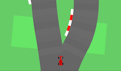
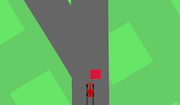

# OpenAi Gym with CarRacing-v1 (unofficial)

This repo has improvements on the complexity for CarRacing-v1, take into account that when the track is more complex, it is also slower.

## Improved

* Complexity of map (several types of intersections)
* Complexity of map (different numbers of lanes)
* Obstacles added
* More control over the agent
* Easy to modify the reward function
* Control where to position the car and its speed
* Extra controlls
* Meta information about the track
* Car can go in reverse, break is SPACE

   * where are the intersections
   * Where are the T-junctions
   * Where are the X-junctions
   * The angle of the curve
   * Positions near intersections, curves, or obstacles

* Function to apply (random) force to the car, to simulate noise or malfunctioning

Here some images of some changes:

### Maps

Some maps

you can have even more complex maps

even more complex maps are possible but not recomended. Part of the complexity of the maps comes from the change of the number of lanes (which is a parameter) some screenshots of it:

another source of complexity is the obstacles (shown below) which can be configured (the number of obstacle in each track), but to modify their shape and the negative value (in the reward function) would be straight forward by looking at the code

## Improvements

This are some improvements of the environment, this allows configures each experiments depending on the objective

### Set the car in certain position in the map

`place_agent (position)` : this function will place the car in `position`

### Set intial speed of agent

`set_speed(speed)`: This function will set the initial of the car

### Ger random position in the track

`get_rnd_point_in_track(border)` : returns a random point in the track with the angle equal to the tile of the track, the x position can be randomly in the x (relative) axis of the tile, border=True make sure the x position is enough to make the car fit in the track, otherwise the point can be in the extreme of the track and two wheels will be outside the track
Returns: [beta, x, y]

### Extra controls

During the game, calling `python gym/envs/box2d/car_racing.py` use the following keys to do certain stuff

* `D`: To enter python debug mode
* `Z`: Zoom in or out
* `R`: Get new track `reset`

## To Improve (by importance)

### high priority: 

- [ ] Implement black and white output
- [ ] Implement number of frames as input
- [ ] Discretise action space
- [ ] Figure out how to implement the reward efficiently
- [ ] Detect change of line (DOES NOT MAKE SENSE TO IMPLEMENT RIGHT NOW)
- [ ] Get tile with certain conditions:

   - [x] ~~With certain angle (e.g. >40º <- that is possible using `info['angle']` but it is not recommended, use get_rnd_tile_by_type_angle)~~
   - [x] ~~In an T-junction~~
   - [x] ~~In an X-junction~~
   - [ ] With obstacle in front (DOES NOT MAKE SENSE TO IMPLEMENT RIGHT NOW)

- [ ] Apply (random) force to the car (CONSIDER IF IT IS WORTH IT IMPLEMENTING IT)
- [x] ~~Set speed of car~~
- [x] ~~Set position of car~~
- [x] ~~Add small distance to d to joing tracks, bigger than x and greater than 50~~
- [x] ~~Avoid change lanes after change lanes~~
- [x] ~~Do NOT compare first tile of main track with last tile of `self.track`~~
- [x] ~~Get rnd position in track~~
- [x] ~~Get correct intersections (all true positive)~~
- [x] ~~Differentiate intersections~~
- [x] ~~Add obstacles~~
- [x] ~~Get outside position (use `get_position_outside(d)`)~~

### low priority:

- [ ] Differentiate y from t junctions
- [ ] Differentiate x from merge juntions
- [ ] Add road lines
- [ ] Fix joints of roads in some cases
- [ ] Change car when not racing
 
---

