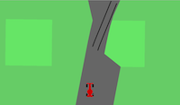
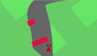

# CarRacing-v1
An improvement over OpenAI gym Car-Racing-v0

This repo has improvements on the complexity for CarRacing-v0, which are focus torwards making `Car-Racing` env solvable, it s also intended to make the env complex enought to make it ideal to try new more complex tasks and RL problems. 

## New Features

The new environment has some improvements regarding the complexity of the map, the action space and the observation space, let's start with the most useful changes

### New Features in `action_space`

The action space can be:

* Continous (the original one), with min of `[-1,0,0]` and max of `[+1,+1,+1]`.
* Continous allowing car going backwards (reverse), from `[-1,-1,0]` to `[+1,+1,+1]`.
* Discrete, the action space is `[TURN_LEFT, TURN_RIGHT, ACCELERATE, BREAK, DO_NOTHING]`

### New Features in `observation_space`

The observation space, i.e. the state (the raw pixels of the game), can be:

* RGB (the original observation space) size `96x96x3`
* Grayscale, size `96x96`
* RGB with several contiguous frames, size `NUM_FRAMESx96x96x3` or `NUM_FRAMESx96x96` for grayscale
* Include or not the information panel containing representations of the speed, direction, etc., size the same size for each case.

some screenshots of some of the possible states (in real size i.e. `96x96`):

### New Features regarding the Map

The map of the track now is configurable but still completely random, now the map can be configurable with

* Different type of road intersections and junctions, value in `{1,2}`, `1` for normal original track (faster to compute and create but without any interesection). `2` for track much more complex with different intersections such as t-junctions and x-intersections. Take into account that when the track is more complex, it is also slower. some images:

* Different numbers of lanes, value in `{1,2}` in bot case the *total* width of track will be the same in general. `1` for only one lane, `2` to incorporate two different lanes in order to keep track of which lane the car is and use that in the reward function, e.g. to train an agent to keep lane, or to take over, etc. Some screenshots:

* Obstacles added, the value is the number of obstacles in the track starting from `0` (i.e. no obstacles). Steping on an obstacle is `-10` in the reward function. The value `-10` is hard-coded, but it is easy to modify in the file. The size and position of the obstacle are random, probably in next versions they will be configurable

* Meta information about the track. It is easy to get the positions where t-junctions and intersections (a.k.a. *interesting points*) are, or get positions close to those interesting points and facing them, also possible to get positions or close positions to obstacles. It is also possible to get possitions close to interesting points controlling how close one wants it to be to the interesting point, e.g. `0` would mean the position is `0` tiles away of the interesting point, i.e. the position is the interesting point. In general it is possible to know

   * Where are the intersections
   * Where are the T-junctions
   * Where are the X-junctions
   * The angle of the curve
   * Positions near intersections, curves, or obstacles

### New Features regarding Reward Function

* Easy to modify the reward function
* Configure how long the car can be outside track before restarting env
* Now the reaward function takes into account:

	* Obstacles
	* (in next versions) The lane in which the car is.
	* (in next versions) The speed of the car.

### New Features regarding Agent (i.e. car)

* Control where to position the car at any time of time. There are functions to easily place the car in random positions close to obstacles, inside or outside the track and in next versions the angle in which the car is facing (towards the track or not, or how much towards the car) will be configurable as well.

* Control the speed of the car when placing it in a position. This function is intended to traing the agent in interesting positions and different speed to mimic when the car goes out of track or losses control.

* Function to apply (random) force to the car, to simulate noise or malfunctioning, **To be implemented in coming versions**.

### Features regarding debugging

* Car can go in reverse, break is `SPACE`
* During the game, calling `python gym/envs/box2d/car_racing.py` use the following keys to do certain stuff

* `D`: To enter python debug mode
* `Z`: Zoom in or out
* `R`: Get new track `reset`
* `Q`: quit, close game

## Useful functions

**This list is far from comprehensive**. This are some improvements of the environment, this allows configures each experiments depending on the objective

* Set the car in certain position in the map: `place_agent (position)` : this function will place the car in `position`
* Set intial speed of agent: `set_speed(speed)`: This function will set the initial of the car
* Ger random position in the track: `get_rnd_point_in_track(border)` : returns a random point in the track with the angle equal to the tile of the track, the x position can be randomly in the x (relative) axis of the tile, border=True make sure the x position is enough to make the car fit in the track, otherwise the point can be in the extreme of the track and two wheels will be outside the track
Returns: [beta, x, y]. 
* Get screenshot of the space in the current step: `screenshot(dest,namefile)`

## List

| *Name* | *params* | *Description* |
| --- | ---| --- |
| `play` | `env,discretize` | Opens a windows in which you can play this game |
| `set_speed` | `speed` | Set the speed of the car |
| `place_agent` | `position` | Set the agent in `position` |
| `screenshot` | `dest, name` | Saves the current state/observations of the agent in `dest` with name `name` |
| `get_rnd_point_in_track` | `border` | Gets a random position inside the track (touching or not the border) |
| `get_position_near_junction` | `type_junction, tiles_before` | Returns a position `tiles_before` tiles before the `type_junction` junction |
| `get_position_outside` | `distance` | Returns a position outside the track `distance` meters far from track |

## Things to do or done:

### high priority: 

- [x] ~~Add controlls to deactivate reverse~~
- [x] ~~End episode after `max_time_out` *seconds* out of track/without moving~~
- [x] ~~Implement black and white output: use `grayscale` opt in config~~
- [x] ~~Add small screenshot of what the car is seeing as a function: use `screenshot` func~~
- [x] ~~Add option to remove bottom panel from state, use `show_info_panel` in config~~
- [x] ~~Implement number of frames to return as observations (state), use `frames_per_state` in config~~
- [x] ~~Hard Discretise action space~~
- [x] ~~Clip reward per episode, use `max/min_episode_reward`~~
- [ ] Fix sizes to use with cnn and different configs for states
- [ ] Soft Discretise action space
- [ ] Figure out how to implement the reward efficiently
- [ ] Detect change of line (DOES NOT MAKE SENSE TO IMPLEMENT RIGHT NOW)
- [ ] Get tile with certain conditions:

   - [x] ~~With certain angle (e.g. >40º <- that is possible using `info['angle']` but it is not recommended, use get_rnd_tile_by_type_angle)~~
   - [x] ~~In an T-junction~~
   - [x] ~~In an X-junction~~
   - [ ] With obstacle in front (DOES NOT MAKE SENSE TO IMPLEMENT RIGHT NOW)

- [ ] Apply (random) force to the car (CONSIDER IF IT IS WORTH IT IMPLEMENTING IT)
- [x] ~~Set speed of car~~
- [x] ~~Set position of car~~
- [x] ~~Add small distance to d to joing tracks, bigger than x and greater than 50~~
- [x] ~~Avoid change lanes after change lanes~~
- [x] ~~Do NOT compare first tile of main track with last tile of `self.track`~~
- [x] ~~Get rnd position in track~~
- [x] ~~Get correct intersections (all true positive)~~
- [x] ~~Differentiate intersections~~
- [x] ~~Add obstacles~~
- [x] ~~Get outside position (use `get_position_outside(d)`)~~

### low priority:

- [ ] Randomize the direction (following the track direction or backwards) in get positions functions
- [ ] Differentiate y from t junctions
- [ ] Differentiate x from merge juntions
- [ ] Add road lines graphically 
- [ ] Fix joints of roads in some weird cases
- [ ] Change img of car when not racing
 
--- 

for more information about the environment see the original readme file of the original repo
